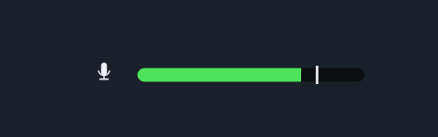

# MicVisual

A microphone level indicator for [R.E.P.O.](https://store.steampowered.com/app/2132060/R_E_P_O_).

A small microphone icon sits in the bottom-right corner of the screen, next to a green bar that
fills up in real time while you talk and drains back down when you stop.



## How it works

REPO already measures your microphone for you. `PlayerVoiceChat.Update` samples the Photon Voice
recorder's audio clip every frame and stores the mean absolute amplitude of the last
`sampleDataLength` samples in the private `clipLoudness` field (scaled by your in-game microphone
volume setting). That is the exact signal the game transmits to other players.

This mod reads that same field, so the bar matches what your teammates hear — and, importantly, it
never opens a second microphone stream of its own, which would compete with the game's recorder and
can fail outright on Windows.

The field is resolved by reflection at startup. If a future game update renames or removes it, the
mod logs a warning and hides the indicator rather than failing to load.

> **Note:** the game's own microphone volume setting (0–100 in the options) scales `clipLoudness`,
> so turning that slider down also makes the bar read lower. That is intentional — the bar tracks
> what other players hear — but it does mean `Sensitivity` compensates for both at once.

## How it is displayed

Everything is driven from a Harmony postfix on the game's own update loop, and drawn with IMGUI.

**Why the patch.** BepInEx creates plugin objects during the preloader, *before* the Unity player
loop starts. A `MonoBehaviour` created there never gets `Start` or `Update` called — which is why
earlier versions of this mod logged their startup line and then silently did nothing. Patching
`RoundDirector.Update` (the same target other REPO overlays use) means the code runs inside a live
frame. `PlayerVoiceChat.Update` is used as a fallback target if `RoundDirector` ever disappears.

**Why IMGUI.** Drawing goes through `GUI.DrawTexture` in `OnGUI`, which needs no `Canvas`, no
`RectTransform` hierarchy, no `CanvasScaler` and no sprite on disk. It draws after the game's UI and
sits at `GUI.depth = -1000` so nothing paints over it.

The panel is laid out from the bottom-right corner in 1080p reference pixels and scaled by
`Screen.height / 1080`, mirroring the canvas-based approach. Offsets follow the same convention as
the other REPO overlays: `MarginRight` is the gap to the right edge, `MarginBottom` the gap to the
bottom edge. The bar is assembled from a rounded cap, a flat middle and a rounded cap so its ends
keep their radius at any fill width.

If it still does not show up, check `BepInEx/LogOutput.log` for these two lines, in order:

```
MicVisual 1.0.0 loaded
Patched RoundDirector.Update
```

and set `Indicator / Verbose` to `true` to log the raw level every two seconds.

Note that BepInEx only reads the plugins folder when the game process starts, so a freshly copied
DLL has no effect until the game is fully closed and relaunched.

## Requirements

- R.E.P.O. with [BepInEx 5](https://github.com/BepInEx/BepInEx/releases) (Bleeding Edge package)

## Install

1. Drop `MicVisual.dll` into `REPO/BepInEx/plugins/`.
2. Start the game.

To install from a Thunderstore package, use the Thunderstore Mod Manager and pick **MicVisual**.

## Configuration

Config lives in `REPO/BepInEx/config/com.repo.micvisual.cfg` and is re-read live, so you do not need
a restart.

| Section | Key | Default | Meaning |
| --- | --- | --- | --- |
| Indicator | `Enabled` | `true` | Show the indicator at all. |
| Indicator | `Verbose` | `false` | Log the raw level and state every two seconds. Use this to tune `Sensitivity`. |
| Indicator | `Sensitivity` | `4` | How hard the level fills the bar. Raise it if the bar barely moves. |
| Indicator | `NoiseFloor` | `0.02` | Levels below this count as silence, so the bar does not flicker on room noise. |
| Indicator | `AttackSpeed` | `18` | Rise speed, units per second. |
| Indicator | `ReleaseSpeed` | `6` | Fall-back speed, units per second. |
| Indicator | `ShowPeakMarker` | `true` | Thin marker at the highest recent level. |
| Indicator | `PeakDecay` | `0.6` | How fast the peak marker falls back. |
| Indicator | `HideWhenSilent` | `false` | Fade the whole indicator out during silence. |
| Indicator | `SilentHideDelay` | `0.6` | Seconds of silence before fading out. |
| Indicator | `FadeSpeed` | `6` | Fade speed of the whole indicator. |
| Layout | `Scale` | `1` | Size multiplier. |
| Layout | `MarginRight` | `20` | Distance from the right edge, in 1080p reference pixels. |
| Layout | `MarginBottom` | `40` | Distance from the bottom edge, in 1080p reference pixels. |

While you are muted in-game the indicator turns grey and the bar empties.

## Building

```
build.bat
```

or

```
dotnet build -c Release
```

The game directory is taken from the `RepoDir` property in the csproj. Override it if R.E.P.O. is
installed somewhere else:

```
dotnet build -c Release -p:RepoDir="D:\SteamLibrary\steamapps\common\REPO"
```

The compiled mod lands in `bin/Release/MicVisual.dll` and is staged into
`Thunderstore/plugins/MicVisual.dll`, ready to zip up as a Thunderstore package.

## Layout of the code

| File | Role |
| --- | --- |
| [MicVisualMod.cs](MicVisualMod.cs) | Plugin entry point, configuration, the patch on the game's update loop, and the `MicIndicatorPatch` postfix that ticks the indicator once per frame. |
| [MicIndicator.cs](MicIndicator.cs) | Indicator state, smoothing, and the IMGUI drawing. |
| [MicLevelSource.cs](MicLevelSource.cs) | Reads `clipLoudness`, mute and device state from `PlayerVoiceChat` via reflection. |
| [UiSprites.cs](UiSprites.cs) | Draws the mic glyph and the rounded bar cap procedurally, so there are no image assets. |
